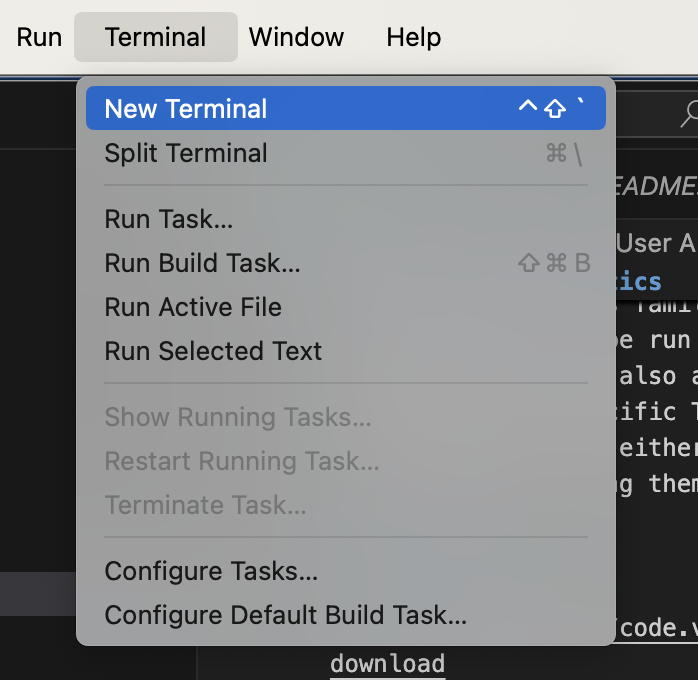
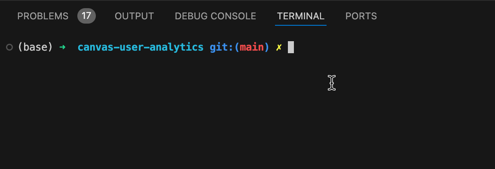
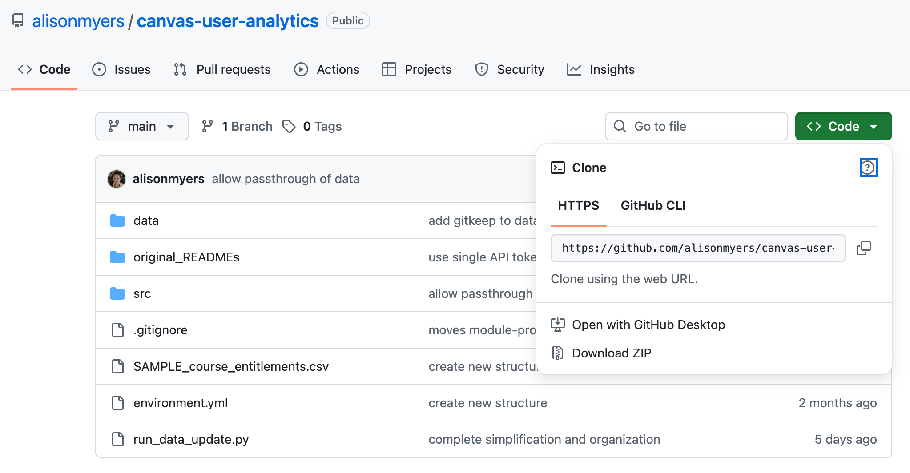
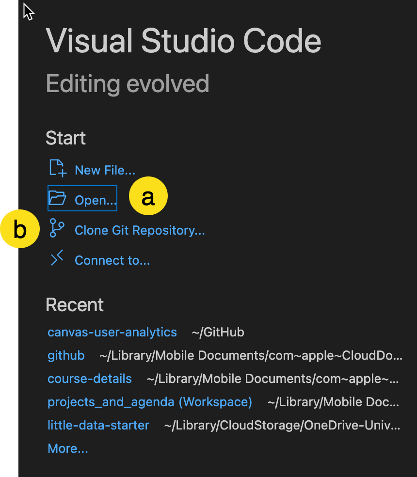
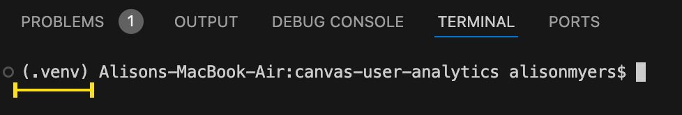
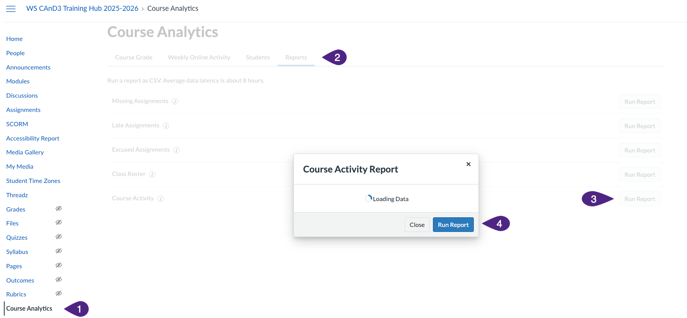

# Canvas User Analytics

This project contains a number of scripts for generating data intended to visualize students progress in a Canvas course. It also allows users to summarize "Canvas Analytics" (previously known as New Analytics) at the course level. 

The script component gathers, cleans and exports data from the [Canvas LMS REST API](https://canvas.instructure.com/doc/api/index.html). This data can then be imported into Tableau and explored using a collection of interactive dashboards.

The project is a hybrid of Canvas Module Progress and Course Details projects. It was designed assuming the user is familiar with either of these projects, to be run for a single course at a time. The scripts also assume that the user is connecting to a specific Tableau workbook. If you are unfamiliar with either of the projects above, I recommend reviewing them individually.

## Installation (Once)

### 1. VS Code: https://code.visualstudio.com/download 

Open VS Code, and open a new terminal:



in the following steps you'll use the terminal in VSCode



### 2. Homebrew: https://brew.sh/
### 3. Follow homebrew instructions to install `Git`: https://git-scm.com/downloads/mac

### 4. Download a copy of this project either via Zip or clone



You can now open the project folder in VSCode! (Open folder)



*Alternate: you can clone the github repo to keep the project in sync. This requires a github account and a few additional setup steps.*

## Environment Setup
In terminal - enter the following commands:

1. Create a new Virtual Environment

```bash
python3 -m venv .venv
```

2. Activate the environment
```bash
source .venv/bin/activate
```
You'll see in brackets that the terminal is now using the environment



3. Install the requirements.txt (downloads packages needed to run the scripts)

a) 
```bash
pip install --upgrade pip
```

b)
```bash
pip install -r requirements.txt
```


## .env Setup
> You'll typically do this once, but you may need to update the COURSE_ID in the file once saved if using for multiple courses.

- Create a file called `.env` in the `canvas-user-analytics` folder with the following fields:

  ```
  API_TOKEN =  # paste your personal token here
  COURSE_ID = # course id here i.e 12345
  API_URL = 'https://canvas.ubc.ca'
  ```
⚠️ Your token should be kept private and secure. We recommend setting expiry on your tokens, and deleting from Canvas once no longer needed.

How to get a Canvas API Token: https://community.canvaslms.com/t5/Canvas-Basics-Guide/How-do-I-manage-API-access-tokens-in-my-user-account/ta-p/615312


## Updating Data / Running the Script - You'll do this every time.

### Downloading New Analytics

The project relies on a regular download of Canvas's Analytics data. You should be downloading the data from canvas - the scripts will prompt you to add the data to the correct folder when needed.

1. Navigate to Canvas Analytics
2. Then to Reports
3. Select Course Activity Run Report
4. Select `Run Report` in dialog



3. Save this activity file in `data/{COURSE_ID}/user_input/new_analytics_input/`

4. In VS Code: Open the project folder canvas-user-analytics
  - Check that terminal is mirroring the folder name `canvas-user-analytics`

5. Activate the environment (if it is not active already)

```bash
source .venv/bin/activate
```


6. Run the script
```bash
python3 -m run
```

- Watch the messages in the terminal and look for any action steps (blue/white)
  
- You will see 2 input steps you must confirm: that Canvas Analytics data has been added, and that Gradebook data has been added
- Review the printed output and ensure necessary courses have completed successfully. If a course fails, error messages will provide info about what went wrong.


## Project Structure

`/src`: Python files with all the logic for gathering data from Canvas and outputting data.

`/data/COURSE_ID`: Holds the data outputted by the script. Output data will be organized into folders titled after the Canvas course id. Tables will be located in this directory in CSV files.

`/data/COURSE_ID/module_progress-Tableau`: contains **status.csv** and **module_data.csv** which detail run status and course data respectively. These three CSV's get imported into Tableau.

`/data/COURSE_ID/project_data`: This data is generated by the script 

`/data/COURSE_ID/user_input/new_analytics_input`: store your Course Analytics download here - you should add a new file when you want to update the data

`/data/COURSE_ID/user_input/gradebook_input`: this only needs to be added once (unless your course has users that add/drop regularly). This should be the Canvas gradebook download

`.env`: _Created manually_. Where user sets their Canvas API Token.

`requirements.txt`: environment file

## Authors and Contributers
- [Alison Myers](https://github.com/alisonmyers)
- [Marko Prodanovic](https://github.com/markoprodanovic)
- [Jeremy H](https://github.com/JeremyH011)
- [Ranjit Sundaramurthi](https://github.com/ranjitprakash1986/module-progress-dashboard) for his work developing a web version of the dashboard

